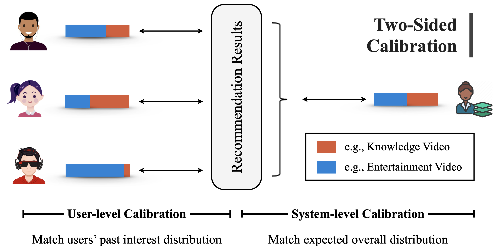

# TiMiRec



This is our public implementation for the paper:

*Chenyang Wang, Zhefan Wang, Yankai Liu, Yang Ge, Weizhi Ma, Min Zhang, Yiqun Liu, Junlan Feng, Chao Deng, and Shaoping Ma. [Target-Interest Distillation for Multi-Interest Recommendation](). In CIKM'22.*

### Getting Started

1. Install [Anaconda](https://docs.conda.io/en/latest/miniconda.html) with Python >= 3.5
2. Clone the repository and install requirements

```bash
git clone -b CIKM22 https://github.com/THUwangcy/ReChorus.git
```

3. Install requirements and step into the `src` folder

```bash
cd ReChorus
pip install -r requirements.txt
cd src
```

4. Run model on the build-in dataset

```bash
# 1. pretrain multi-interest extractor
python main.py --model_name TiMiRec --dataset ml-1m \
               --lr 1e-4 --l2 1e-6 --history_max 20 \
               --K 2 --add_pos 1 --add_trm 1 --stage pretrain

# 2. joint fintune
python main.py --model_name TiMiRec --dataset ml-1m \
               --lr 1e-4 --l2 1e-6 --history_max 20 \
               --K 2 --add_pos 1 --add_trm 1 --stage finetune \
               --check_epoch 10 --temp 0.5 --n_layers 2
```

The main arguments of TiMiRec are listed below.

| Args        | Default  | Help                                                         |
| ----------- | -------- | ------------------------------------------------------------ |
| emb_size    | 64       | Size of embedding vectors                                    |
| K           | 2        | Number of user interests                                     |
| add_pos     | 1        | Whether to add the position embedding (0/1)                  |
| add_trm     | 1        | Whether to add the transformer layer (0/1)                   |
| stage       | finetune | Training stage: pretrain / finetune                          |
| temp        | 1        | Temperature of the distillation loss                         |
| n_layers    | 1        | Number of MLP layers to derive the interest distribution     |
| batch_size  | 256      | Batch size                                                   |
| history_max | 20       | Maximum length of history to consider                        |
| lr          | 1e-3     | Learning rate                                                |
| l2          | 0        | Weight decay of the optimizer                                |
| regenerate  | 0        | Whether to read data again and regenerate intermediate files |

Commands to reproduce the results can be found in [run.sh](https://github.com/THUwangcy/ReChorus/blob/CIKM22/src/run.sh).

## Performance

We use the public [Amazon dataset](http://jmcauley.ucsd.edu/data/amazon/links.html) (*Grocery_and_Gourmet_Food* category, 5-core version) as a benchmark dataset. Other datasets in the paper can be generated by the jupyter notebook in the data folder. 

The table below lists the results of these models in `Grocery_and_Gourmet_Food` dataset (145.8k entries). Leave-one-out is applied to split data: the most recent interaction of each user for testing, the second recent item for validation, and the remaining items for training. We randomly sample 99 negative items for each test case to rank together with the ground-truth item.

| Model                                                                                           | HR@5   | NDCG@5 | Time/iter | Sequential | Transformer |
| ----------------------------------------------------------------------------------------------- | ------ | ------ | --------- | ---------- | ----------- |
| [BPR](https://github.com/THUwangcy/ReChorus/tree/CIKM22/src/models/general/BPR.py)              | 0.3574 | 0.2480 | 2.5s      |            |             |
| [LightGCN](https://github.com/THUwangcy/ReChorus/tree/CIKM22/src/models/general/LightGCN.py)    | 0.3713 | 0.2577 | 6.1s      |            |             |
| [GRU4Rec](https://github.com/THUwangcy/ReChorus/tree/CIKM22/src/models/sequential/GRU4Rec.py)   | 0.3664 | 0.2597 | 4.9s      | √          |             |
| [SASRec](https://github.com/THUwangcy/ReChorus/tree/CIKM22/src/models/sequential/SASRec.py)     | 0.3888 | 0.2923 | 7.2s      | √          | √           |
| [TiSASRec](https://github.com/THUwangcy/ReChorus/tree/CIKM22/src/models/sequential/TiSASRec.py) | 0.3916 | 0.2922 | 7.6s      | √          | √           |
| [ComiRec](https://github.com/THUwangcy/ReChorus/tree/CIKM22/src/models/sequential/ComiRec.py)   | 0.3763 | 0.2694 | 4.5s      | √          |             |
| [ComiRec+](https://github.com/THUwangcy/ReChorus/tree/CIKM22/src/models/sequential/TiMiRec.py)  |        |        |           | √          | √           |
| [TiMiRec](https://github.com/THUwangcy/ReChorus/tree/CIKM22/src/models/sequential/TiMiRec.py)   |        |        |           | √          |             |
| [TiMiRec+](https://github.com/THUwangcy/ReChorus/tree/CIKM22/src/models/sequential/TiMiRec.py)  | 0.4063 | 0.3087 | 8.8s      | √          | √           |

## Citation

```
TBD
```

## Contact

Chenyang Wang ([THUwangcy@gmail.com](mailto:THUwangcy@gmail.com))
